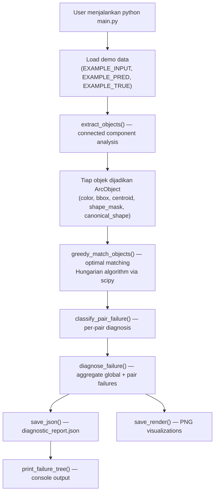
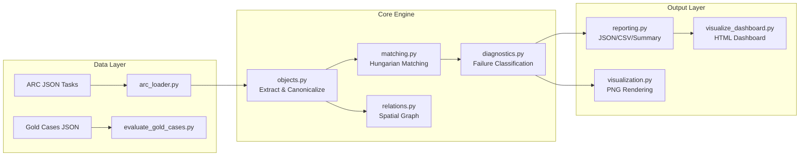

# Deep Analysis: ARC-Vision-Inspector

## 1. Aplikasi Ini Menyelesaikan Masalah Apa?

ARC-Vision-Inspector menyelesaikan masalah **"kenapa model AI gagal dalam tugas visual reasoning abstrak"**, bukan sekadar mengukur "berapa skor akurasinya".

### Masalah yang diselesaikan:
Kebanyakan evaluasi model AI hanya menghasilkan satu angka: **akurasi final** (benar/salah). Ini tidak berguna untuk debugging karena tidak menjelaskan **di mana** dan **mengapa** model gagal.

Framework ini mendekomposisi kegagalan menjadi kategori yang **interpretable**:

| Failure Category | Contoh |
|---|---|
| `missing_object` | Model "lupa" menyertakan objek yang seharusnya ada |
| `spurious_object` | Model "menghalusikan" objek yang tidak seharusnya ada |
| `color_mismatch` | Bentuk & posisi benar, tapi warna salah |
| `shape_mismatch` | Geometri objek berubah |
| `position_or_translation_mismatch` | Objek benar, tapi posisinya salah |
| `orientation_or_reflection_mismatch` | Objek dirotasi/refleksi padahal seharusnya tidak |
| `area_mismatch` | Ukuran objek (jumlah pixel) berubah |

> [!IMPORTANT]
> Ini bukan model AI itu sendiri — ini adalah **alat evaluasi** (evaluator/grader) yang menganalisis output dari model AI terhadap ground truth.

---

## 2. Alur Satu Fitur Utama: Diagnosis Kegagalan

Berikut alur lengkap dari user menjalankan `python main.py` sampai data tersimpan:



### Langkah Detail:

1. **Input**: 3 grid integer 2D — `input`, `prediction`, `ground_truth` dari [demo_data.py](file:///c:/Users/Lenovo/Documents/project/ML%20expert/demo_data.py)

2. **Object Extraction** ([objects.py:54-108](file:///c:/Users/Lenovo/Documents/project/ML%20expert/core/objects.py#L54-L108)):
   - Grid → numpy array
   - Inferensi warna background (warna paling sering)
   - BFS/DFS flood-fill 4-connected component → pixel clusters
   - Setiap cluster → `ArcObject` dataclass dengan: `obj_id`, `color`, `pixels`, `area`, `bbox`, `centroid`, `shape_mask`, `canonical_shape`, `variant_signatures`

3. **Shape Canonicalization** ([objects.py:47-52](file:///c:/Users/Lenovo/Documents/project/ML%20expert/core/objects.py#L47-L52)):
   - Setiap shape mask dirotasi 0°/90°/180°/270° + flip horizontal/vertikal → 12 varian
   - Varian yang paling kecil secara leksikografis = canonical shape
   - Ini memungkinkan perbandingan **rotation-invariant**

4. **Object Matching** ([matching.py:39-91](file:///c:/Users/Lenovo/Documents/project/ML%20expert/core/matching.py#L39-L91)):
   - Scoring multi-feature: color (3.0) + area (2.0) + canonical shape (4.0) + centroid proximity (max 2.0) = max score 11.0
   - **Hungarian algorithm** via `scipy.optimize.linear_sum_assignment` untuk optimal matching (bukan greedy, meskipun namanya `greedy_match_objects`)
   - Threshold: score > 0 untuk diterima sebagai match

5. **Failure Classification** ([diagnostics.py:67-96](file:///c:/Users/Lenovo/Documents/project/ML%20expert/core/diagnostics.py#L67-L96)):
   - Per-pair: cek color, area, shape_relation, centroid position
   - Global: cek unmatched objects (missing/spurious), color distribution shift

6. **Output disimpan**:
   - `diagnostic_report.json` — full structured report
   - `input_grid.png`, `pred_grid.png`, `true_grid.png` — visualisasi dengan bounding box & centroid overlay

---

## 3. Struktur Project dan Lokasi Business Logic

```
ML expert/
├── main.py                    # Entry point: single demo run
├── evaluate_arc.py            # Batch evaluation over ARC tasks
├── evaluate_gold_cases.py     # Gold case validation (evaluator reliability)
├── visualize_dashboard.py     # HTML dashboard generator (Chart.js)
├── demo_data.py               # Hardcoded example grids
├── requirements.txt           # numpy, pillow (+ scipy implicit)
│
├── core/                      # ★ SEMUA BUSINESS LOGIC ADA DI SINI
│   ├── __init__.py
│   ├── grid_utils.py          # Primitif: numpy conversion, BFS neighbors, mask ops, rotation/flip
│   ├── objects.py             # Object extraction (connected components) + ArcObject dataclass
│   ├── matching.py            # Object scoring + Hungarian matching + shape relation detection
│   ├── diagnostics.py         # ★ CORE: diagnose_failure(), classify_pair_failure()
│   ├── relations.py           # Spatial relation graph (touches, contains, relative position)
│   ├── reporting.py           # CSV/JSON export, health score calculation, executive summary
│   └── visualization.py       # PIL-based grid rendering with overlays
│
├── data/
│   ├── sample_tasks/          # 3 ARC JSON task files
│   └── gold_cases/            # 8 gold validation cases
│
├── outputs/                   # Generated results
│   ├── single_run/
│   ├── batch_run/
│   └── gold_eval/
│
└── notebooks/
    └── analysis_notes.md      # Future analysis ideas
```

> [!TIP]
> **Business logic utama** terpusat di `core/diagnostics.py` — khususnya fungsi [diagnose_failure()](file:///c:/Users/Lenovo/Documents/project/ML%20expert/core/diagnostics.py#L98-L141) yang mengorkestrasikan seluruh pipeline: extract → match → classify → aggregate.

### Dependency Chain:
```
grid_utils.py → objects.py → matching.py → diagnostics.py → reporting.py
                                                ↑
                                          visualization.py
```

---

## 4. Database Schema

**Aplikasi ini TIDAK menggunakan database.** Semua data adalah file-based:

### "Schema" (Struktur Data):

#### ArcObject Dataclass ([objects.py:14-26](file:///c:/Users/Lenovo/Documents/project/ML%20expert/core/objects.py#L14-L26)):
```python
@dataclass
class ArcObject:
    obj_id: int                           # Unique per grid
    color: int                            # 0-9 (ARC palette)
    pixels: List[Tuple[int, int]]         # All (row, col) coordinates
    area: int                             # len(pixels)
    bbox: Tuple[int, int, int, int]       # (min_r, min_c, max_r, max_c)
    height: int
    width: int
    centroid: Tuple[float, float]
    shape_mask: Tuple[Tuple[int]]         # Cropped binary mask
    canonical_shape: Tuple[Tuple[int]]    # Rotation-invariant normalized shape
    variant_signatures: Dict[str, Tuple]  # All 12 rotation/flip variants
```

#### Input Data (ARC JSON format):
```json
{
  "train": [
    {"input": [[int, ...], ...], "output": [[int, ...], ...]}
  ],
  "test": [
    {"input": [[int, ...], ...], "output": [[int, ...], ...]}
  ]
}
```

#### Output Data (Diagnostic Report):
```json
{
  "object_counts": {"input": N, "pred": N, "true": N},
  "color_distribution": {"pred_colors": {}, "true_colors": {}, "match": bool},
  "matching": {"matches": [...], "unmatched_pred": [], "unmatched_true": []},
  "pair_diagnostics": [{"pred_obj_id": int, "pair_failures": [...]}],
  "global_failures": ["missing_object", ...]
}
```

---

## 5. "Endpoint" / Service Paling Penting

Ini bukan web service, tapi CLI tool. "Endpoint" utamanya adalah **fungsi**:

### 1. `diagnose_failure(input_grid, pred_grid, true_grid)` — **The Central Function**
- **Lokasi**: [diagnostics.py:98-141](file:///c:/Users/Lenovo/Documents/project/ML%20expert/core/diagnostics.py#L98-L141)
- **Input**: 3 grid 2D (list of list of int)
- **Output**: Structured dict dengan seluruh analisis kegagalan
- **Cara kerja**: Extract objects → Match → Classify → Return report

### 2. `extract_objects(grid)` — Object Extraction Engine
- **Lokasi**: [objects.py:54-108](file:///c:/Users/Lenovo/Documents/project/ML%20expert/core/objects.py#L54-L108)
- **Cara kerja**: Connected component via flood-fill DFS + shape canonicalization

### 3. `greedy_match_objects(pred_objs, true_objs)` — Optimal Matching
- **Lokasi**: [matching.py:39-91](file:///c:/Users/Lenovo/Documents/project/ML%20expert/core/matching.py#L39-L91)
- **Cara kerja**: Cost matrix → Hungarian algorithm → filtered matches (score > 0)

### 4. `extract_transformations(input_grid, output_grid)` — Rule Extraction
- **Lokasi**: [diagnostics.py:7-39](file:///c:/Users/Lenovo/Documents/project/ML%20expert/core/diagnostics.py#L7-L39)
- **Cara kerja**: Match input↔output objects, compute deltas (translation, color change, shape change)

### Entry Points CLI:
| Command | Fungsi |
|---|---|
| `python main.py` | Single demo run |
| `python evaluate_arc.py` | Batch evaluation semua tasks di `data/sample_tasks/` |
| `python evaluate_gold_cases.py` | Validasi reliabilitas evaluator |
| `python visualize_dashboard.py` | Generate HTML dashboard |

---

## 6. Authentication dan Authorization

> [!NOTE]
> **Tidak ada.** Ini adalah offline CLI tool, bukan web application. Tidak ada user session, API key, atau access control. Semua operasi berjalan lokal di mesin pengguna, membaca file JSON dari disk dan menulis output ke disk.

---

## 7. Bug Teknis Paling Sulit (yang terlihat dari codebase)

Berdasarkan analisis kode, saya identifikasi beberapa bug/masalah teknis yang **sudah diperbaiki** atau **masih ada**:

### Bug yang Sudah Diperbaiki:
**Evolusi dari Greedy → Hungarian Matching**

Dari [1.md](file:///c:/Users/Lenovo/Documents/project/ML%20expert/1.md) (versi awal) terlihat matching dulunya **true greedy** (sort candidates, greedily pick best):
```python
# Versi lama (1.md L560-602):
candidates.sort(reverse=True, key=lambda x: x[0])
for score, i, j in candidates:
    if i in used_pred or j in used_true:
        continue
    ...
```

Ini bermasalah karena greedy matching **tidak optimal** — bisa menghasilkan assignment yang buruk secara global meskipun locally optimal.

**Fix**: Di versi sekarang ([matching.py](file:///c:/Users/Lenovo/Documents/project/ML%20expert/core/matching.py)), sudah menggunakan `scipy.optimize.linear_sum_assignment` (Hungarian algorithm) untuk matching yang **globally optimal**.

### Bug yang Masih Ada:

1. **`scipy` tidak ada di `requirements.txt`** — [requirements.txt](file:///c:/Users/Lenovo/Documents/project/ML%20expert/requirements.txt) hanya listing `numpy` dan `pillow`, tapi [matching.py](file:///c:/Users/Lenovo/Documents/project/ML%20expert/core/matching.py#L3) mengimport `from scipy.optimize import linear_sum_assignment`. Ini akan crash pada fresh install.

2. **`flatten_pair_failures` di `evaluate_gold_cases.py` memflatten `dict` bukan `str`** — Di versi lama, `pair_failures` berisi string. Di versi sekarang ([diagnostics.py:67-96](file:///c:/Users/Lenovo/Documents/project/ML%20expert/core/diagnostics.py#L67-L96)), `pair_failures` berisi `List[Dict]` (dengan `type`, `magnitude`). Tapi [evaluate_gold_cases.py:24-28](file:///c:/Users/Lenovo/Documents/project/ML%20expert/evaluate_gold_cases.py#L24-L28) melakukan `labels.extend(pd.get("pair_failures", []))` yang akan memasukkan dict ke dalam list, lalu `sorted(set(labels))` akan crash karena dict unhashable.

---

## 8. Bagian Paling Lemah / Fragile

### 1. **Object Extraction Hanya 4-Connected, Hanya Monokrom**
- [objects.py](file:///c:/Users/Lenovo/Documents/project/ML%20expert/core/objects.py): Connected components hanya mendeteksi pixel **warna yang sama** yang bersebelahan secara 4-arah
- **Fragile karena**: ARC tasks sering memiliki objek **multi-warna** atau objek yang terhubung diagonal. Framework ini akan memecah objek multi-warna menjadi beberapa objek terpisah, menghasilkan diagnosis yang misleading

### 2. **Shape Canonicalization — 12 Varian Saja**
- [grid_utils.py:55-62](file:///c:/Users/Lenovo/Documents/project/ML%20expert/core/grid_utils.py#L55-L62): `all_shape_variants` menghasilkan 12 varian (4 rotasi × 3: original + flip_h + flip_v)
- Seharusnya ada 8 varian unik (4 rotasi × 2: original + flip), karena `rot0_flip_v` = `rot180_flip_h`. Ini menambah computational cost tanpa menambah coverage

### 3. **Scoring Weights di Matching Hardcoded dan Tidak Validated**
- [matching.py:20-37](file:///c:/Users/Lenovo/Documents/project/ML%20expert/core/matching.py#L20-L37): Weights (color=3, area=2, shape=4, centroid=2) adalah magic numbers tanpa justifikasi empiris
- Centroid proximity menggunakan formula `max(0, 2.0 - 0.2 * dist)` yang arbitrary

### 4. **Gold Case Evaluator Mismatch dengan Diagnostics API**
- Seperti disebut di bagian bug: format `pair_failures` sudah berubah dari `List[str]` ke `List[Dict]`, tapi gold case evaluator belum diupdate

### 5. **Tidak Ada Unit Test Sama Sekali**
- Zero automated tests. Regresi tidak terdeteksi.

---

## 9. Kalau Traffic Naik 10x, Bottleneck Pertama

> [!NOTE]
> Ini bukan web application, jadi "traffic" di sini berarti **jumlah tasks/grids yang diproses**.

### Bottleneck #1: `extract_objects()` — O(R×C) per Grid × 3 Kali Per Evaluation

Setiap call ke `diagnose_failure()` menjalankan `extract_objects()` **3 kali** (input, pred, true). Dan [visualization.py:41](file:///c:/Users/Lenovo/Documents/project/ML%20expert/core/visualization.py#L41) menjalankannya **lagi** saat rendering overlay. Totalnya: **6 kali extract per evaluation** kalau render juga.

### Bottleneck #2: Shape Canonicalization — O(N_objects × 12 rotations)

Untuk setiap objek, [canonicalize_shape()](file:///c:/Users/Lenovo/Documents/project/ML%20expert/core/objects.py#L47-L52) generates 12 numpy array variants, converts each to tuple, dan sort. Ini berat untuk objek besar.

### Bottleneck #3: `touches()` in Relations — O(|pixels_a| × |pixels_b|)

Fungsi [touches()](file:///c:/Users/Lenovo/Documents/project/ML%20expert/core/relations.py#L5-L12) menggunakan nested loop brute force untuk cek adjacency. Untuk objek besar ini quadratic.

### Bottleneck #4: Hungarian Algorithm — O(N³)

[matching.py](file:///c:/Users/Lenovo/Documents/project/ML%20expert/core/matching.py) menggunakan `linear_sum_assignment` yang O(N³) dimana N = jumlah objek. Untuk grids dengan banyak objek kecil, ini mahal.

### Kalau benar-benar mau scale:
```
1. Cache extract_objects() results (jangan extract ulang di visualization)
2. Parallelisasi batch evaluation dengan multiprocessing
3. Ganti touches() dengan pixel proximity via set lookups
4. Limit shape variant generation untuk objek di atas threshold area tertentu
```

---

## 10. Kalau Mulai Ulang dari Nol, Apa yang Akan Didesain Berbeda?

### 1. **Multi-Color Object Support**
Saat ini objek didefinisikan HANYA oleh connected pixels warna sama. ARC tasks sering punya pattern multi-warna yang merupakan satu "entitas logis". Dari nol, saya akan implementasi **hierarchical object extraction**: warna-level components → grouped via spatial proximity → composite objects.

### 2. **Plugin Architecture untuk Failure Classifiers**
Saat ini semua failure classification hardcoded di [classify_pair_failure()](file:///c:/Users/Lenovo/Documents/project/ML%20expert/core/diagnostics.py#L67-L96). Desain yang lebih baik: registry pattern dimana failure classifiers bisa di-register, di-enable/disable, dan di-configure tanpa modifikasi source code.

### 3. **Proper Test Suite dari Awal**
Bukan gold cases sebagai afterthought, tapi pytest unit tests untuk setiap modul. Test-driven development untuk object extraction, matching, dan classification.

### 4. **Configurable Scoring**
Matching weights dan thresholds seharusnya di config file (YAML/JSON), bukan hardcoded. Ini memungkinkan tuning per-dataset.

### 5. **Web Interface bukan CLI-only**
Dashboard saat ini ([visualize_dashboard.py](file:///c:/Users/Lenovo/Documents/project/ML%20expert/visualize_dashboard.py)) hanya static HTML generator. Desain yang lebih baik: interactive web app (Streamlit/Gradio) dimana user bisa upload task, lihat diagnosis real-time, drill-down ke specific failures, dan compare different predictor modes.

### 6. **Separation of IO dan Logic**
Saat ini [diagnose_failure()](file:///c:/Users/Lenovo/Documents/project/ML%20expert/core/diagnostics.py#L98-L141) menerima raw grids dan menjalankan extraction sendiri. Lebih baik: extraction terpisah, lalu pass objects ke diagnosis. Ini menghindari double extraction dan membuat pipeline lebih composable.

### 7. **Formal Dependency Management**
`scipy` dipakai tapi tidak di `requirements.txt`. Dari nol: `pyproject.toml` atau minimal `requirements.txt` yang benar, plus CI check.

---

## Ringkasan Arsitektur



> [!TIP]
> **Kekuatan utama** project ini: dekomposisi kegagalan yang sangat terstruktur dan interpretable. **Kelemahan utama**: hanya mendukung single-color connected components dan tidak punya automated tests.
